# 🏭 Vigilon — Secure Self-Evolving Industrial Intelligence Network

<div align="center">


**A privacy-preserving, attack-resilient federated learning system for industrial predictive maintenance.**

Factories learn from each other — without sharing a single byte of raw data.

[Overview](#-overview) · [Architecture](#-full-system-architecture) · [Setup](#-installation--setup) · [Run It](#-how-to-run) · [Demo](#-demo-flow)

</div>

---

## 📋 Table of Contents

1. [Overview](#-overview)
2. [Problem Statement](#-problem-statement)
3. [Solution](#-solution)
4. [Project Objectives and Applications](#-project-objectives-and-applications)
5. [Theoretical and Technical Background](#-theoretical-and-technical-background)
6. [Full System Architecture](#-full-system-architecture)
7. [Development Plan](#-development-plan)
8. [Hardware Bill of Materials](#-hardware-bill-of-materials)
9. [Weekly Checkpoints and Success Criteria](#-weekly-checkpoints-and-success-criteria)
10. [Installation & Setup](#-installation--setup)
11. [Project Structure](#-project-structure)
12. [How to Run](#-how-to-run)
13. [Demo Flow](#-demo-flow)
14. [Results and Evaluation](#-results-and-evaluation)
15. [Team](#-team)

---

## 🔭 Overview

**Vigilon** is a federated edge learning framework designed for industrial environments. Modern factories generate enormous volumes of sensor data — vibration, temperature, current draw — that are critical for detecting machine failures before they happen (predictive maintenance). However, this data is confidential: it reveals trade secrets, production volumes, and machine configurations that no factory wants to share with competitors or a central cloud.

Vigilon solves this by enabling multiple factories to **collaboratively train a shared fault-detection model without any factory ever sending its raw data to another party**. Instead, only model parameter updates (weights) travel across the network. The central coordinator aggregates these updates, produces an improved global model, and returns it. Raw industrial data never leaves the factory floor.

On top of this, Vigilon incorporates:
- **Robust aggregation** to defend against malicious factories sending poisoned updates
- **Differential privacy** to prevent reverse-engineering of private data from model weights
- **Non-IID data simulation** to accurately reflect real-world factory heterogeneity
- **A live monitoring dashboard** to track the system's performance in real time

> **In one line:** Factories learn together, stay private, and stay secure — simultaneously.

---

## 🚨 Problem Statement

### The Industrial Data Dilemma

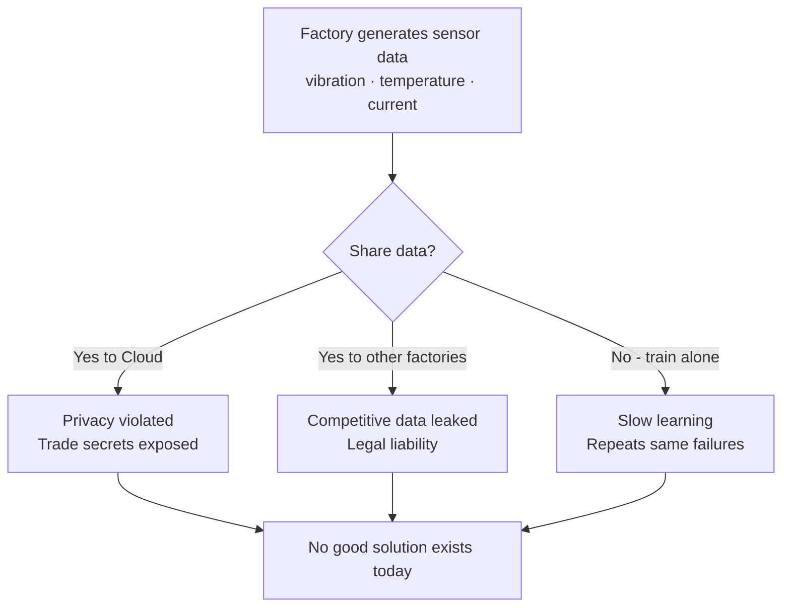

### Why This Is a Hard Problem

| Problem | Description | Impact |
|---|---|---|
| **Data Confidentiality** | Sensor data reveals machine speeds, production rates, part quality — all trade secrets | Factories legally cannot share raw data |
| **Isolated Learning** | Each factory sees only its own failure patterns | Rare failure types go undetected for years |
| **Security Threats** | A compromised factory can corrupt the entire shared model | One bad actor breaks the system for everyone |
| **Privacy Leakage** | Even model weight updates can leak information about training data through gradient inversion attacks | Sharing weights is not automatically safe |
| **Edge Constraints** | Factory edge devices have limited CPU, RAM, and no GPU | Heavy models cannot run on real hardware |
| **Non-IID Data** | Each factory runs different machines at different loads | Standard ML assumptions break down |

### Scale of the Problem

Unplanned industrial downtime costs the global manufacturing sector an estimated **$50 billion per year**. Predictive maintenance powered by collaborative ML could prevent a significant fraction of these failures — but only if factories can collaborate without sacrificing privacy.

---

## 💡 Solution

Vigilon introduces a **Secure Federated Edge Learning Framework** that decouples learning from data ownership.

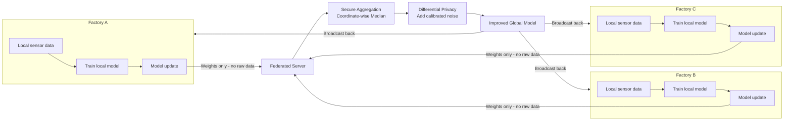

**Core insight:** Model weights encode *what was learned*, not *what the data was*. A weight value of `0.73` tells you nothing about the temperature reading that produced it. Sharing weights is fundamentally different from sharing data.

### Key Innovations

1. **No raw data movement** — ever. The server only ever sees aggregated weight tensors.
2. **Robust aggregation** — coordinate-wise median instead of FedAvg makes poisoning attacks ineffective.
3. **Differential privacy** — calibrated Gaussian noise added before aggregation prevents gradient inversion.
4. **Non-IID simulation** — Dirichlet distribution used to create realistic uneven data splits across clients.
5. **Live dashboard** — Streamlit-based monitoring with per-round accuracy, loss curves, and attack indicators.

---

## 🎯 Project Objectives and Applications

### Primary Objectives

- Achieve **≥85% fault detection accuracy** on CWRU bearing dataset using federated training
- Demonstrate that federated accuracy is **within 3–5% of centralized** training accuracy
- Show that system **recovers accuracy within 5 rounds** after a poisoning attack when median aggregation is enabled
- Run full training on a **standard laptop** with no GPU required
- Complete one federated round in **under 60 seconds**

### Real-World Applications

| Domain | Application | How Vigilon Helps |
|---|---|---|
| **Automotive manufacturing** | Detecting bearing faults in stamping presses | Multiple plants collaborate without sharing production data |
| **Aerospace** | Turbine blade anomaly detection | Safety-critical models improve across sites without IP exposure |
| **Medical devices** | Manufacturing quality control | Regulatory-compliant collaboration (HIPAA, GDPR) |
| **Power generation** | Generator fault prediction | Grid operators share learning without revealing capacity data |
| **Mining** | Conveyor belt and crusher monitoring | Remote sites with limited connectivity benefit from global model |
| **Pharmaceutical** | Cleanroom equipment monitoring | FDA-sensitive data stays local, but models improve globally |

---

## 📚 Theoretical and Technical Background

### 1. Federated Learning

Federated Learning (FL) was introduced by Google in 2017. The key algorithm used here is **FedAvg** (McMahan et al., 2017) and its robust variant using **coordinate-wise median**.

#### FedAvg Algorithm

```
Global model: w_0
For each round t = 1, 2, ..., T:
    Server broadcasts w_t to all K clients
    Each client k:
        w_k = LocalTrain(w_t, local_data_k, epochs=E)
        Send delta_w_k = w_k - w_t to server
    Server aggregates:
        w_{t+1} = sum( n_k/n * w_k )       <- FedAvg
        w_{t+1} = median( {w_k} )           <- Robust variant (this project)
```

#### One Complete Federated Round

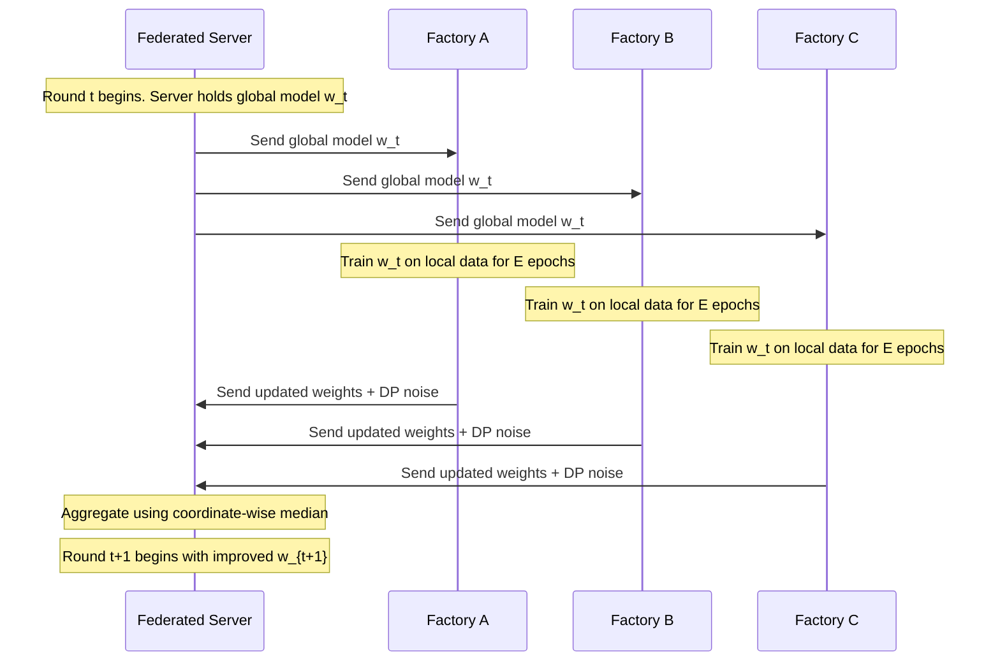

---

### 2. The 1D Convolutional Neural Network (1D-CNN)

Vibration sensor data is a **time series** sampled at 12,000 Hz. A 1D-CNN slides filters along the time axis and learns local patterns — spikes, frequency components, waveform shapes — that distinguish healthy from faulty machines.

#### Model Architecture

```mermaid
flowchart LR
    IN["Input\n1 x 1024"] -->|Conv1D 32 filters kernel=64| C1["Feature Map\n32 x 961"]
    C1 -->|ReLU + MaxPool pool=4| P1["32 x 240"]
    P1 -->|Conv1D 64 filters kernel=32| C2["64 x 209"]
    C2 -->|ReLU + MaxPool pool=4| P2["64 x 52"]
    P2 -->|Flatten| FL["3328 units"]
    FL -->|Dense 128 + ReLU + Dropout 0.5| D1["128 units"]
    D1 -->|Dense 4 + Softmax| OUT["4 classes:\nNormal / Inner / Outer / Ball"]
```

#### Why 1D-CNN over other models?

| Model | Pros | Cons | Verdict |
|---|---|---|---|
| **1D-CNN** (chosen) | Fast, small, captures local patterns, edge-friendly | Less long-range context than LSTM | Best for this task |
| LSTM | Long-range dependencies | Slow, high memory, hard to train | Too heavy for edge |
| Autoencoder | Unsupervised, no labels needed | Lower accuracy on known faults | Use only if labels unavailable |
| MLP | Simplest, fastest | Cannot exploit temporal structure | Poor accuracy on raw signals |

---

### 3. The CWRU Bearing Dataset

The **Case Western Reserve University Bearing Dataset** is the most widely used benchmark for machine fault detection. It is **free** and publicly available.

**Download:** https://engineering.case.edu/bearingdatacenter/download-data-file

#### What It Contains

| Fault Type | Description | Label |
|---|---|---|
| Normal | No fault present | 0 |
| Inner race fault | Damage to inner bearing ring | 1 |
| Outer race fault | Damage to outer bearing ring | 2 |
| Ball fault | Damage to rolling elements | 3 |

Fault diameters: 0.007, 0.014, 0.021 inches. Sampling rate: 12,000 Hz (drive end).

#### Data Pipeline

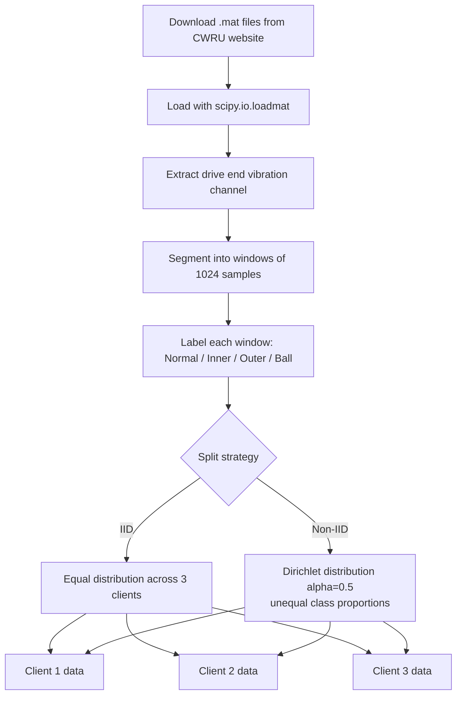

The **Dirichlet distribution** with parameter `alpha` controls unevenness. Low alpha (0.1) = very unequal. High alpha (10) = nearly equal. We use `alpha = 0.5` as a realistic middle ground.

---

### 4. Security: Model Poisoning Attack and Defense

#### Attack and Defense Flow

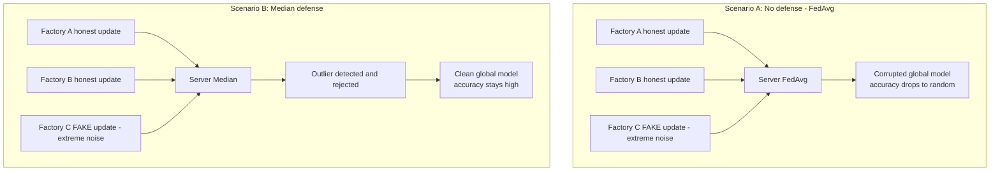

#### Why Median Works — Concrete Example

For one specific weight position across 3 clients:

```
Client A (honest):  w = 0.42
Client B (honest):  w = 0.39
Client C (attacker): w = 187.3   <- extreme outlier

FedAvg result:  (0.42 + 0.39 + 187.3) / 3 = 62.7   <- completely wrong
Median result:  sort([0.39, 0.42, 187.3]) -> pick middle -> 0.42   <- correct
```

This is applied **coordinate-wise** — independently for every single weight in the model (tens of thousands of them).

---

### 5. Differential Privacy

Even honest weight updates can leak training data through gradient inversion attacks (Zhu et al., 2019).

**Solution: Gaussian Mechanism**

```
delta_w_private = delta_w + N(0, sigma^2 * I)

where sigma = (sensitivity * noise_multiplier) / batch_size
```

The noise is calibrated using privacy budget `epsilon`. Lower epsilon = more private but noisier. We use `epsilon = 1.0`. In practice we use **Opacus** (PyTorch's DP library) which handles gradient clipping and noise automatically.

---

## 🏗️ Full System Architecture

### High-Level Component View

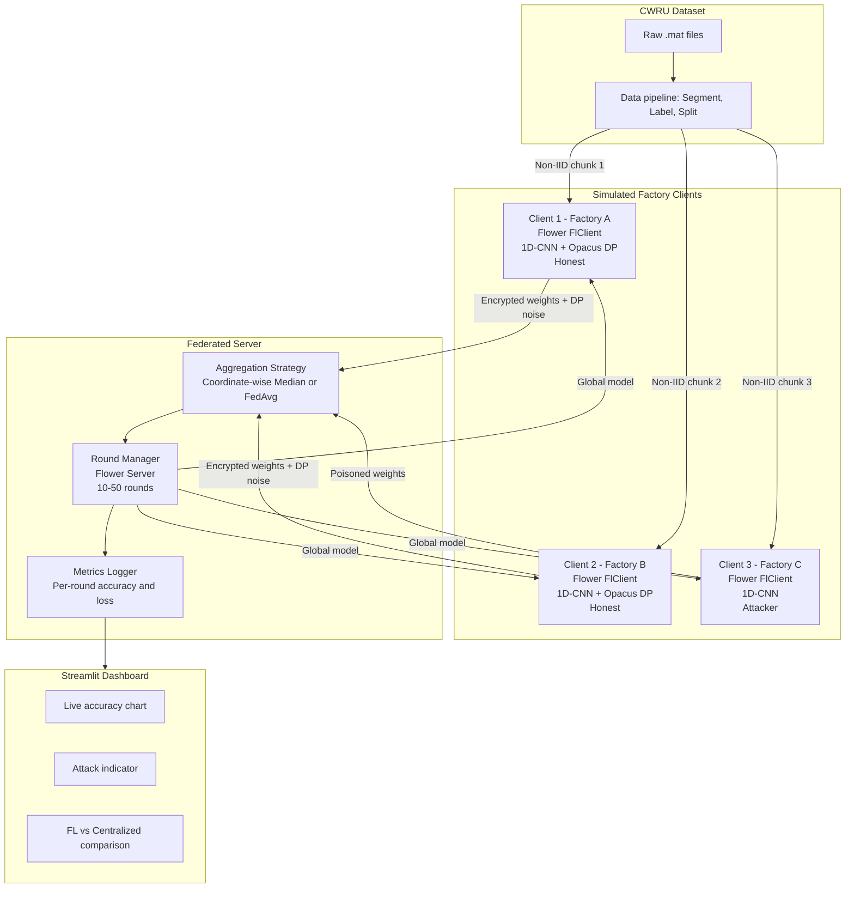

### Full Data Flow — Sequence View

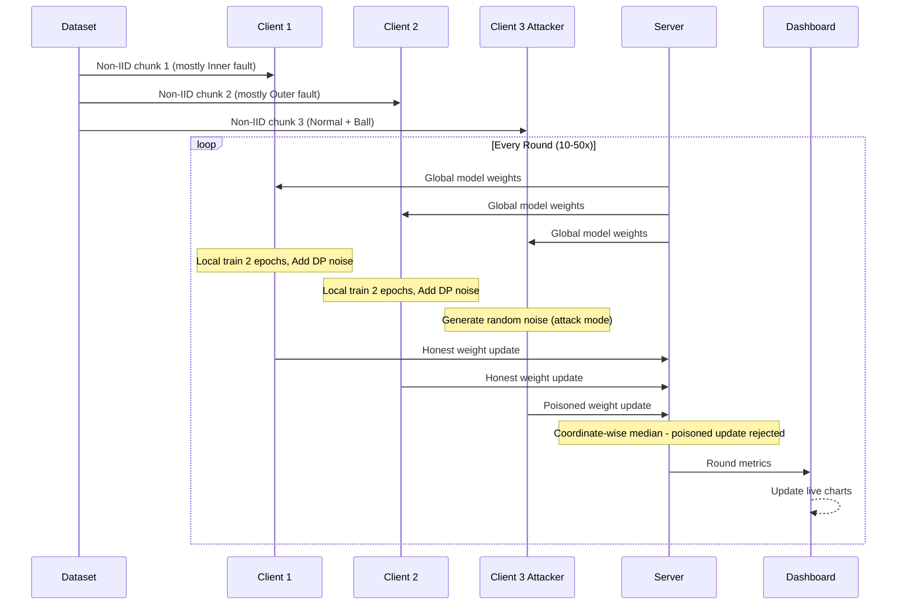

### File-Level Architecture

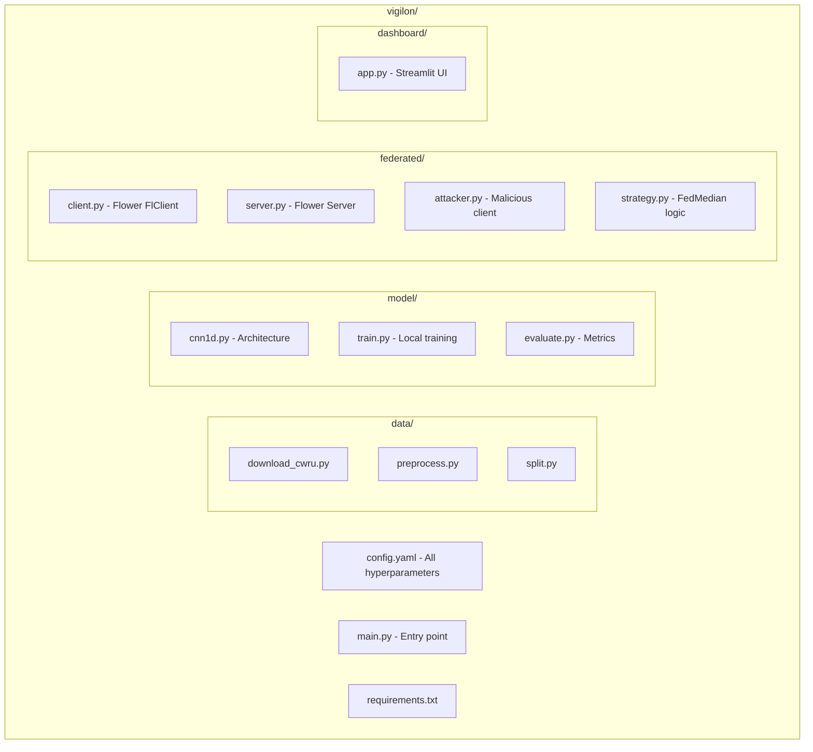

---

## 🗓️ Development Plan

### Gantt Chart

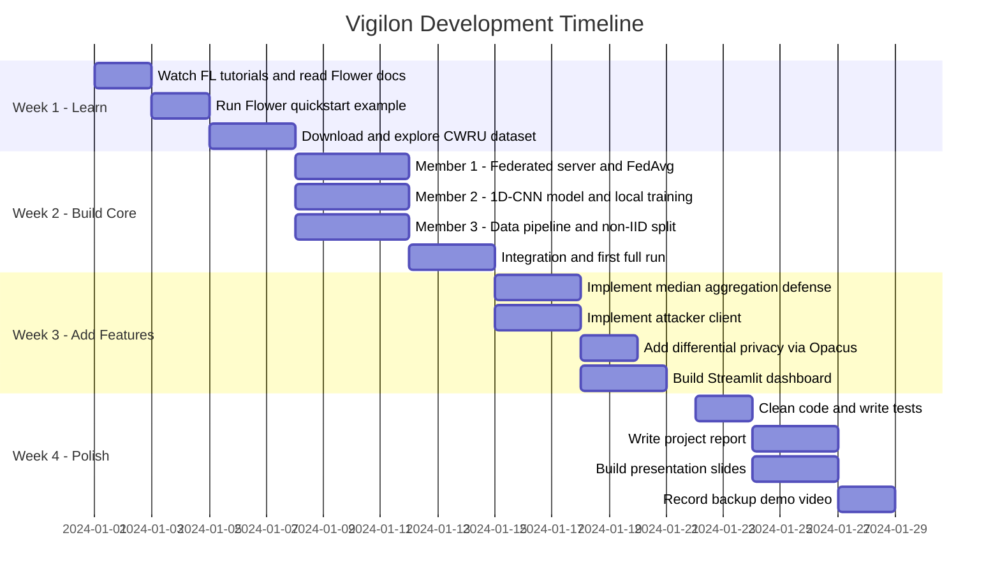

### Team Responsibilities Split

```mermaid
graph LR
    subgraph M1["Member 1 - Server and Security"]
        S1[federated/server.py]
        S2[federated/strategy.py]
        S3[federated/attacker.py]
        S4[Median aggregation logic]
    end

    subgraph M2["Member 2 - Model and Client"]
        M21[model/cnn1d.py]
        M22[model/train.py]
        M23[federated/client.py]
        M24[Differential privacy setup]
    end

    subgraph M3["Member 3 - Data and Dashboard"]
        D1[data/download_cwru.py]
        D2[data/preprocess.py]
        D3[data/split.py]
        D4[dashboard/app.py]
    end

    M1 <-->|Integration| M2
    M2 <-->|Metrics feed| M3
    M1 <-->|Shared config| M3
```

---

## 🔩 Hardware Bill of Materials

### For Prototype — Laptop Only (Recommended for Hackathon)

| Component | Purpose | Cost |
|---|---|---|
| Any laptop with 4GB+ RAM | Runs server + all 3 simulated clients | Already owned |
| Python 3.9+ | Runtime | Free |
| CWRU Dataset | Training data | Free (download) |
| **Total** | | **₹0** |

### For Full Edge Deployment — Optional

| Component | Model | Qty | Purpose | Approx. Cost (INR) |
|---|---|---|---|---|
| Edge compute board | Raspberry Pi 4B 4GB | 3 | One per factory | ₹5,000 x 3 = ₹15,000 |
| MicroSD card | SanDisk 32GB Class 10 | 3 | OS + model storage | ₹400 x 3 = ₹1,200 |
| Vibration sensor | MPU-6050 accelerometer | 3 | Vibration measurement | ₹150 x 3 = ₹450 |
| Current sensor | INA219 | 3 | Electrical current monitoring | ₹200 x 3 = ₹600 |
| Temperature sensor | DS18B20 | 3 | Thermal monitoring | ₹100 x 3 = ₹300 |
| Network switch | TP-Link 5-port | 1 | LAN for inter-device comms | ₹700 |
| Ethernet cables | Cat6 1m | 4 | Wired LAN | ₹200 |
| Power supply | Official RPi 5V 3A | 3 | Per board | ₹400 x 3 = ₹1,200 |
| Breadboard + jumpers | Generic | 3 | Sensor wiring | ₹100 x 3 = ₹300 |
| **Total (edge version)** | | | | **≈ ₹20,000** |

### Sensor Wiring Diagram (Raspberry Pi)

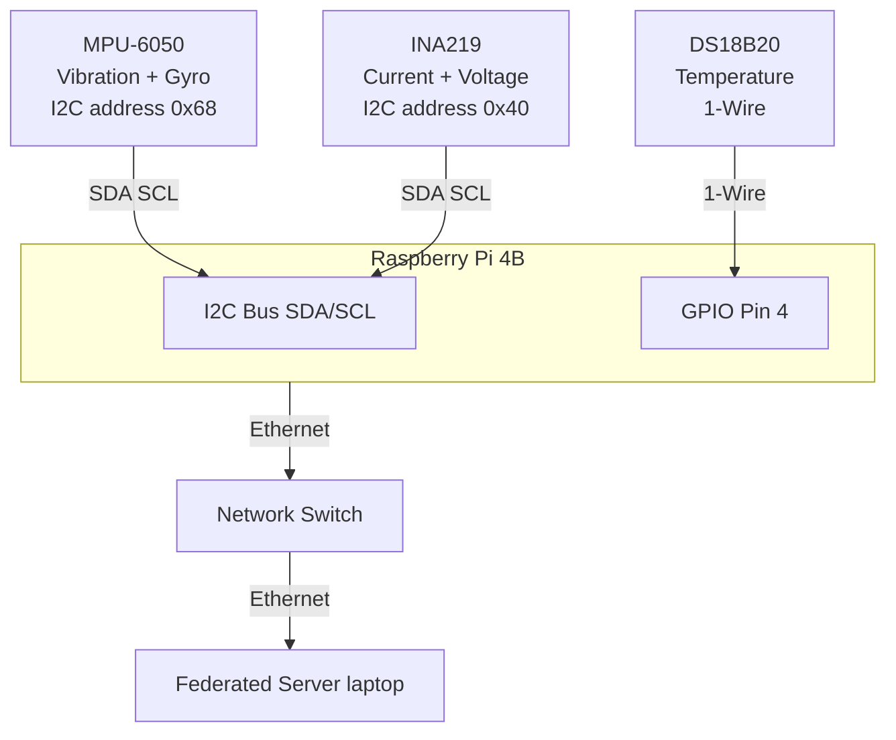

> **Note for hackathon:** No hardware is required. All sensors and factories are simulated in software using the CWRU dataset. Hardware is listed for completeness and future deployment reference only.

---

## ✅ Weekly Checkpoints and Success Criteria

### Week 1 — Concepts and Setup

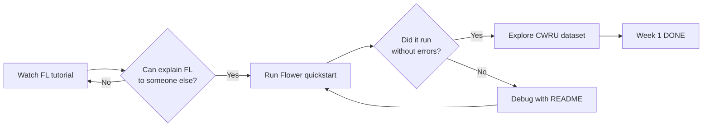

**Criteria:**
- [ ] All 3 members can explain federated learning in their own words
- [ ] Flower quickstart runs on all machines
- [ ] CWRU dataset downloaded and `.mat` files opened successfully
- [ ] Git repository created with initial folder structure
- [ ] `config.yaml` drafted with initial hyperparameters

---

### Week 2 — Core System Running

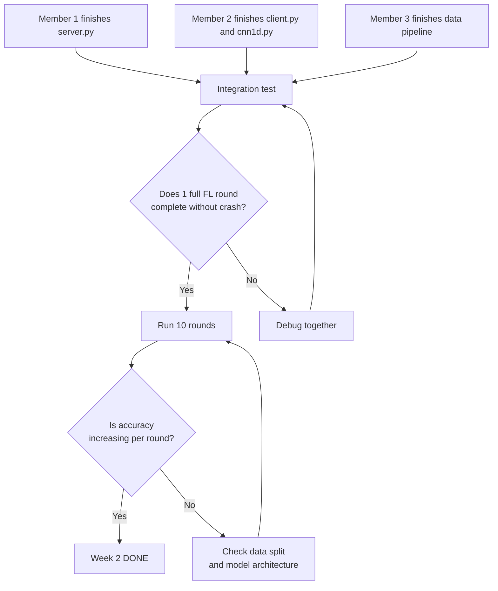

**Criteria:**
- [ ] `python main.py --mode fl --rounds 10` completes without errors
- [ ] Accuracy improves over 10 rounds
- [ ] Model weights correctly aggregated (verify shapes match)
- [ ] Non-IID data split working with different class distributions per client
- [ ] Per-round accuracy logging to console

---

### Week 3 — Security Features and Dashboard

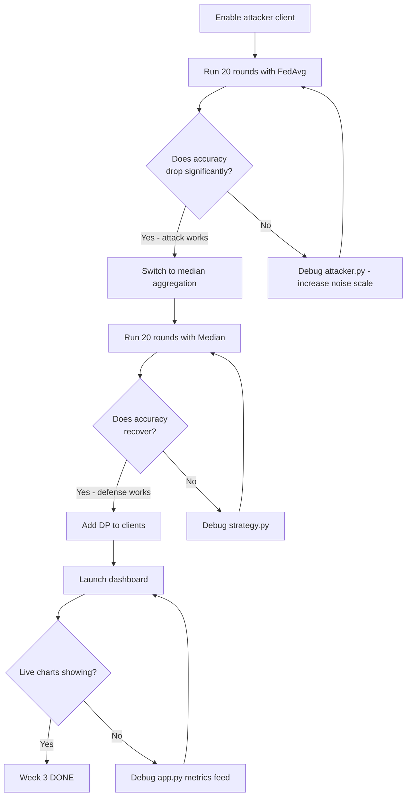

**Criteria:**
- [ ] Attack ON + FedAvg: accuracy drops to below 50% within 10 rounds
- [ ] Attack ON + Median: accuracy stays above 80%
- [ ] Differential privacy enabled with `epsilon = 1.0` — model still converges
- [ ] Streamlit dashboard launches and shows live accuracy per round
- [ ] Dashboard shows red attack indicator when attacker is active

---

### Week 4 — Polish and Presentation Ready

**Criteria:**
- [ ] `git clone` + `pip install -r requirements.txt` + one command runs full demo
- [ ] Every function has a docstring comment
- [ ] 3-act demo rehearsed at least twice by full team
- [ ] Backup demo video recorded (2 min screen recording)
- [ ] Project report: all sections complete, minimum 8 pages
- [ ] Slides: maximum 12 slides, demo video embedded
- [ ] Each member can explain any component independently when asked by a judge

---

## 🔧 Installation & Setup

### Prerequisites

- Python 3.9 or later
- pip package manager
- Git
- 4GB RAM minimum (8GB recommended)
- No GPU required

### Step 1 — Clone the Repository

```bash
git clone https://github.com/your-username/vigilon.git
cd vigilon
```

### Step 2 — Create a Virtual Environment

```bash
# Create environment
python -m venv venv

# Activate on Windows
venv\Scripts\activate

# Activate on macOS / Linux
source venv/bin/activate
```

### Step 3 — Install Dependencies

```bash
pip install -r requirements.txt
```

**`requirements.txt`:**
```
flwr==1.6.0
torch==2.0.1
numpy==1.24.3
scipy==1.11.1
scikit-learn==1.3.0
streamlit==1.25.0
matplotlib==3.7.2
pandas==2.0.3
opacus==1.4.0
PyYAML==6.0.1
tqdm==4.65.0
```

### Step 4 — Download the Dataset

```bash
python data/download_cwru.py
```

If the auto-download fails, manually download `.mat` files from:
https://engineering.case.edu/bearingdatacenter/download-data-file

Place all `.mat` files in `data/raw/`.

### Step 5 — Preprocess the Data

```bash
python data/preprocess.py --window_size 1024 --overlap 0.5
python data/split.py --num_clients 3 --alpha 0.5 --strategy non_iid
```

This creates `data/processed/client_1/`, `client_2/`, and `client_3/` directories.

### Step 6 — Verify Setup

```bash
python main.py --verify
```

Expected output:
```
✅ Dataset: 4 classes, ~12000 samples total
✅ Client splits: [4200, 3800, 4000] samples
✅ Model: 1D-CNN, 47,236 parameters
✅ Flower: version 1.6.0
✅ All checks passed. Ready to run.
```

---

## 📁 Project Structure

```
vigilon/
│
├── main.py                      # Entry point — all modes launched from here
├── config.yaml                  # All hyperparameters (edit this to change settings)
├── requirements.txt
│
├── data/
│   ├── download_cwru.py         # Downloads CWRU .mat files automatically
│   ├── preprocess.py            # Segments signals into 1024-sample windows
│   ├── split.py                 # Non-IID Dirichlet split across clients
│   └── raw/                     # Downloaded .mat files go here
│
├── model/
│   ├── cnn1d.py                 # 1D-CNN architecture (PyTorch nn.Module)
│   ├── train.py                 # Local training loop with DP support
│   └── evaluate.py              # Accuracy, confusion matrix, F1 score
│
├── federated/
│   ├── client.py                # Flower FlClient — honest client
│   ├── server.py                # Flower server setup and configuration
│   ├── strategy.py              # Custom FedMedian aggregation strategy
│   └── attacker.py              # Malicious client (poisoning simulation)
│
├── dashboard/
│   └── app.py                   # Streamlit dashboard (run separately)
│
├── scripts/
│   ├── run_fl.sh                # Starts 1 server + 3 clients in parallel
│   ├── run_demo.sh              # Full 3-act demo sequence
│   └── run_centralized.sh       # Centralized training baseline
│
├── results/
│   ├── metrics/                 # JSON files with per-round metrics
│   └── plots/                   # Saved accuracy and loss plots
│
└── tests/
    ├── test_model.py
    ├── test_aggregation.py
    └── test_data_pipeline.py
```

---

## ▶️ How to Run

### Mode 1 — Standard Federated Learning (No Attack)

```bash
python main.py --mode fl --rounds 20 --clients 3 --aggregation median
```

### Mode 2 — Federated Learning With Poisoning Attack

```bash
# Attack ON, no defense (shows the problem)
python main.py --mode fl --rounds 20 --attack on --aggregation fedavg

# Attack ON, with median defense (shows the solution)
python main.py --mode fl --rounds 20 --attack on --aggregation median
```

### Mode 3 — Centralized Baseline (for comparison)

```bash
python main.py --mode centralized --epochs 20
```

### Mode 4 — Launch the Live Dashboard

Open a **second terminal window** (while FL is running in the first):

```bash
streamlit run dashboard/app.py
```

Open your browser at `http://localhost:8501`

### Mode 5 — Full Demo Script

```bash
bash scripts/run_demo.sh
```

Runs the complete 3-act demo automatically with pauses between acts.

### Configuration Reference (`config.yaml`)

```yaml
# Model
model:
  window_size: 1024
  num_classes: 4
  conv1_filters: 32
  conv2_filters: 64
  dense_units: 128
  dropout: 0.5

# Federated Learning
federated:
  num_rounds: 20
  num_clients: 3
  local_epochs: 2
  local_batch_size: 32
  aggregation: median           # options: fedavg | median

# Security
security:
  attack_enabled: false
  attack_client_id: 2           # Which client is attacker (0-indexed)
  attack_noise_scale: 10.0      # How extreme the poisoned update is

# Differential Privacy
privacy:
  dp_enabled: true
  epsilon: 1.0                  # Privacy budget (lower = more private)
  max_grad_norm: 1.0            # Gradient clipping threshold
  noise_multiplier: 1.1

# Data
data:
  num_clients: 3
  split_strategy: non_iid       # options: iid | non_iid
  dirichlet_alpha: 0.5
  train_ratio: 0.8

# Logging
logging:
  save_metrics: true
  metrics_dir: results/metrics/
  plot_results: true
```

---

## 🎬 Demo Flow

This is the 3-act demo sequence for judges. Takes approximately **8–10 minutes**.

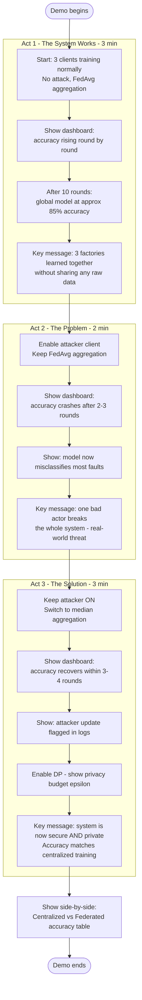

---

## 📊 Results and Evaluation

### Expected Results at Demo Time

| Scenario | Expected Accuracy | Rounds to Convergence |
|---|---|---|
| FL, no attack, FedAvg | 83–87% | 15–20 rounds |
| FL, attack ON, FedAvg | Drops to 30–45% | Collapses in 3–5 rounds |
| FL, attack ON, Median | 80–85% | Recovers within 5 rounds |
| Centralized training | 87–91% | 20 epochs |
| FL with DP (epsilon=1.0) | 79–83% | 20 rounds |

### Metrics Tracked Per Round

| Metric | Description | Target |
|---|---|---|
| Global accuracy | Accuracy on held-out test set | ≥ 85% |
| Global loss | Cross-entropy loss | Decreasing |
| Communication cost | MB of weights transmitted per round | < 2 MB |
| Rounds to convergence | Rounds until accuracy plateaus | < 20 |
| Attack detection rate | Rounds where poisoned update rejected | 100% with median |

### Reproducing All Results

```bash
python main.py --mode fl --rounds 20 --aggregation fedavg --save results/run1_normal.json
python main.py --mode fl --rounds 20 --attack on --aggregation fedavg --save results/run2_attacked.json
python main.py --mode fl --rounds 20 --attack on --aggregation median --save results/run3_defended.json
python main.py --mode centralized --epochs 20 --save results/run4_centralized.json

python scripts/plot_comparison.py --runs results/
```

---

## 👥 Team

**Team Vigilon** — Lovely Professional University

| Member | Role | Responsibilities |
|---|---|---|
| **Aravindhan TV** | Team Lead · Server & Security | `federated/server.py`, `strategy.py`, `attacker.py`, robust aggregation |
| **Adhithyaa A** | Model & Client | `model/cnn1d.py`, `federated/client.py`, differential privacy integration |
| **Kishor T** | Data & Dashboard | `data/` pipeline, non-IID split, `dashboard/app.py`, visualization |

**Project Guides:** Prof. Ch. Ravisankar · Prof. Soumya Biswal

**Contact:** aravindhan.tv2006@gmail.com · kishortjames@gmail.com · Phone: 8870992126

---

## 📖 References

1. McMahan, B., Moore, E., Ramage, D., Hampson, S., & Agüera y Arcas, B. (2017). *Communication-Efficient Learning of Deep Networks from Decentralized Data.* AISTATS 2017.
2. Smith, W. A., & Randall, R. B. (2015). *Rolling element bearing diagnostics using the Case Western Reserve University data.* Mechanical Systems and Signal Processing, 64–65, 100–131.
3. Zhu, L., Liu, Z., & Han, S. (2019). *Deep Leakage from Gradients.* NeurIPS 2019.
4. Blanchard, P., El Mhamdi, E. M., Guerraoui, R., & Stainer, J. (2017). *Machine learning with adversaries: Byzantine tolerant gradient descent.* NeurIPS 2017.
5. Beutel, D. J., et al. (2020). *Flower: A Friendly Federated Learning Research Framework.* arXiv:2007.14390.

---

## 📄 License

This project is licensed under the MIT License. See `LICENSE` for details.

---

<div align="center">

Built for safer, smarter, private industrial AI.

**Team Vigilon · Lovely Professional University · 2024**

</div>
